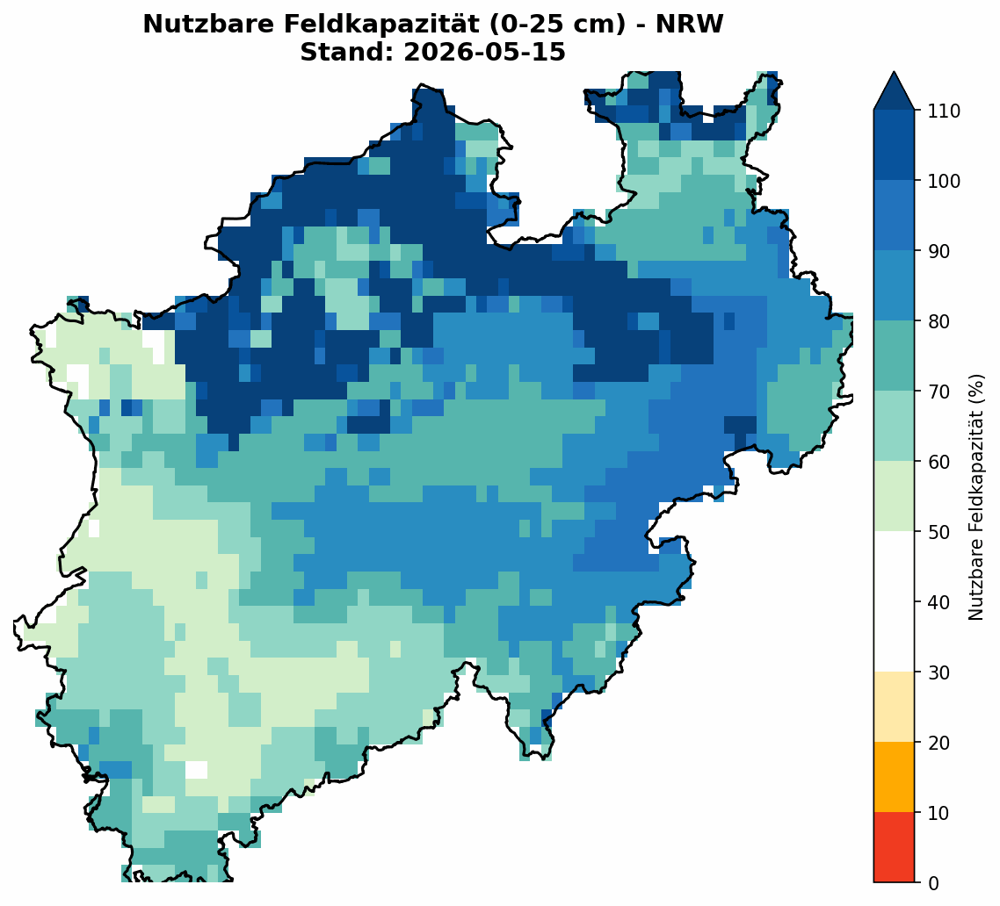

# Tagesaktuelle Nutzkapazität (nFK) im Oberboden (NRW)

Dieses Repository aktualisiert sich vollautomatisch jede Nacht. Es lädt die Rasterdaten des Helmholtz-Zentrums für Umweltforschung (UFZ) herunter und bereitet die nutzbare Feldkapazität (0–25 cm Tiefe) für Nordrhein-Westfalen als animierte Zeitreihe auf.

## Aktuelle Zeitreihe

*Datenbasis: © Helmholtz-Zentrum für Umweltforschung GmbH - UFZ / Dürremonitor Deutschland*
